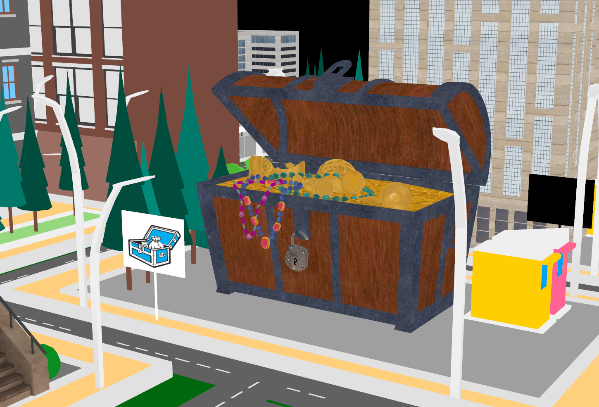
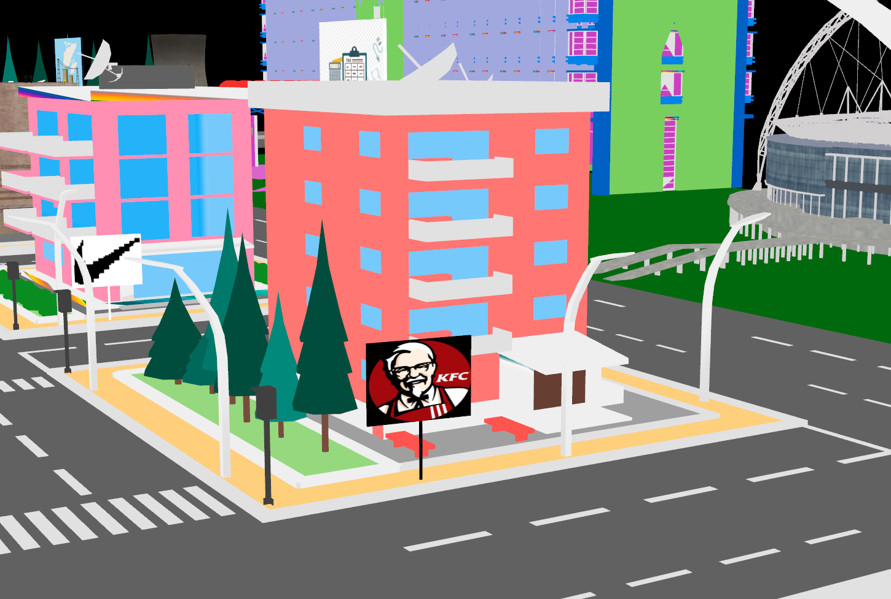
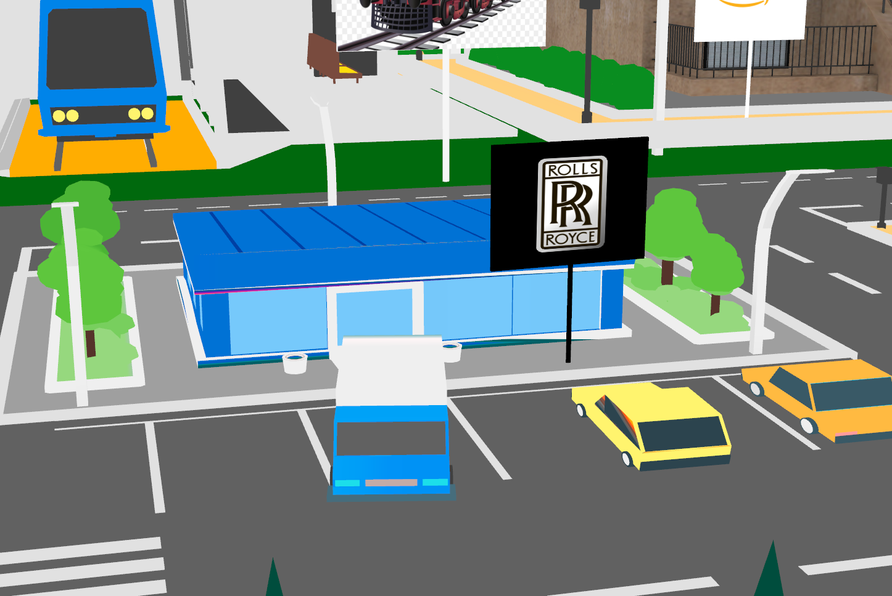

# Monopoly

### A 3d game built with the help of QT and C++

Monopoly is a 3d game played between two players. It has software, fashion, car, finance, food companies where in players can buy, sell and mortage the companies.
The 3d objects made with the help of Blender, constructs the city for the game.
> Need the blender file of the complete city ?
>
> Ping me  

## Sample Shots

> Player1's car in which he would travel across the city

  
> Community chest 

> KFC

> Rolls Royce

> Stadium

## Installation

Requires QT,

Suggested to use QT creator for dev,

[Install QT creator](https://github.com/qt-creator/qt-creator/releases)

## Contributing
Pull requests are welcome. For major changes, please open an issue first to discuss what you would like to change.

Please make sure to update tests as appropriate.

## License
[MIT](https://choosealicense.com/licenses/mit/)
